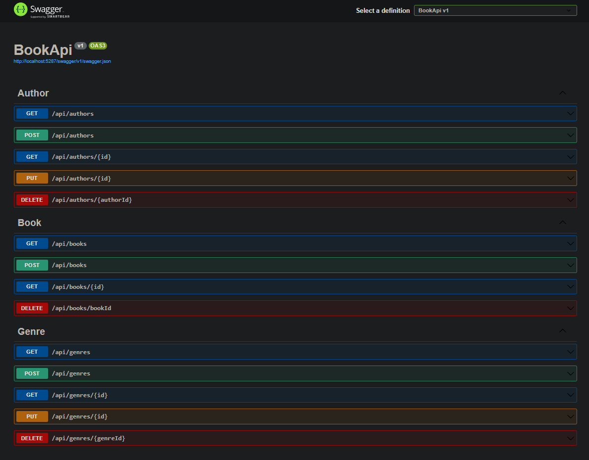

# BookAPI

BookAPI is a simple book management API developed with ASP.NET Core.

## Getting Started

Follow these steps to run the project locally:

1. Clone the repository: `git clone https://github.com/Aaed517/aspnet-core-bookapi`
2. Navigate to the project directory: `cd BookApi`
3. Open a terminal and execute the following commands for database migration:
   ```bash
   dotnet ef migrations add InitialCreate
   dotnet ef database update
4. Restore project dependencies: `dotnet restore`
5. Run the application: `dotnet run`

## Requirements

- .NET Core SDK 8.0 

## Usage

You can use the following endpoints to test the API:

- `GET /api/books`: Lists all books.
- `GET /api/books/{id}`: Retrieves a specific book by ID.
- `POST /api/books`: Adds a new book.
- `DELETE /api/books/{bookId}`: Deletes a book.
- `GET /api/authors`: Lists all authors.
- `GET /api/authors/{id}`: Retrieves a specific author by ID.
- `PUT /api/authors/{id}`: Updates the information of a author.
- `POST /api/authors`: Adds a new author.
- `DELETE /api/authors/{authorId}`: Deletes a author.
- `GET /api/genres`: Lists all genres.
- `GET /api/genres/{id}`: Retrieves a specific genre by ID.
- `PUT /api/genres/{id}`: Updates the information of a genre.
- `POST /api/genres`: Adds a new genre.
- `DELETE /api/genres/{genreId}`: Deletes a genre.
  
## Swagger Page

Here is a screenshot of the Swagger UI page for the BookAPI:


Example usage:

curl -X GET "localhost:port/api/books/bookId
```http
get /api/books/1
{
  "$id": "1",
  "bookId": 2,
  "title": "1984",
  "description": "A dystopian social science fiction novel by George Orwell.",
  "bookAuthors": {
    "$id": "2",
    "$values": [
      {
        "$id": "3",
        "bookId": 2,
        "book": {
          "$ref": "1"
        },
        "authorId": 2,
        "author": {
          "$id": "4",
          "authorId": 2,
          "name": "George Orwell",
          "bookAuthors": {
            "$id": "5",
            "$values": [
              {
                "$ref": "3"
              }
            ]
          },
          "birthDate": "1903-06-25T00:00:00"
        }
      }
    ]
  },
  "genreId": 2,
  "genre": {
    "$id": "6",
    "genreId": 2,
    "name": "Dystopian",
    "books": {
      "$id": "7",
      "$values": [
        {
          "$ref": "1"
        }
      ]
    }
  }
}
